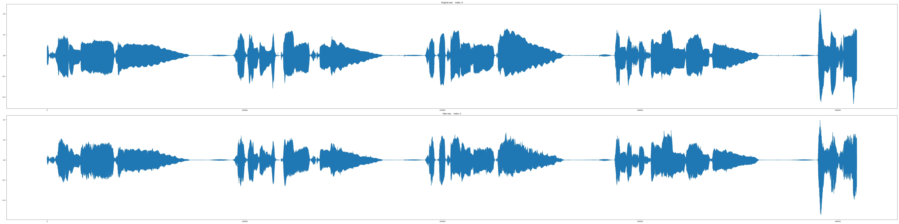
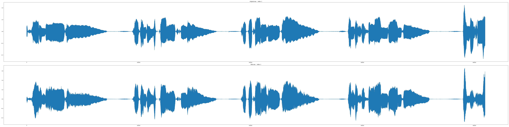
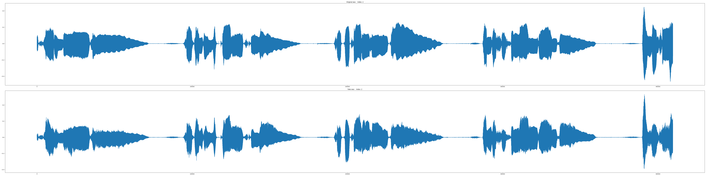
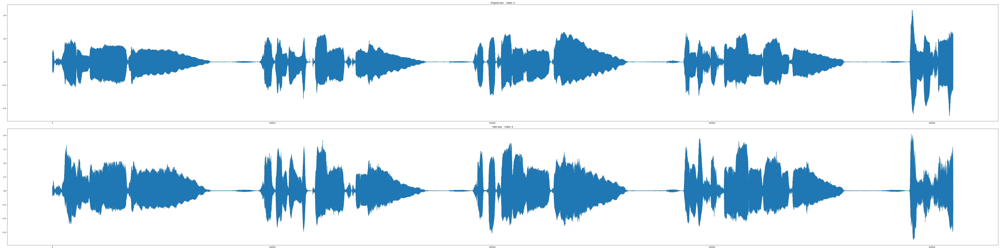
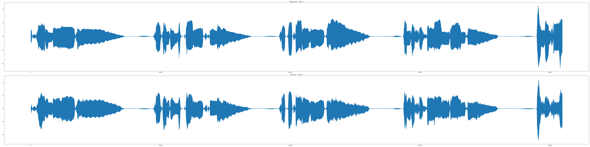

__※ This project has been discontinued. If you would like to suggest any improvements, please register as an issue.__

# Parallel Voice Conversion GAN

This code is an implementation of Parallel Voice Conversion GAN(PVCGAN). The algorithm is based on the following papers:

```
Oord, A. V. D., Dieleman, S., Zen, H., Simonyan, K., Vinyals, O., Graves, A., ... & Kavukcuoglu, K. (2016). Wavenet: A generative model for raw audio. arXiv preprint arXiv:1609.03499.
Yamamoto, R., Song, E., & Kim, J. M. (2020, May). Parallel WaveGAN: A fast waveform generation model based on generative adversarial networks with multi-resolution spectrogram. In ICASSP 2020-2020 IEEE International Conference on Acoustics, Speech and Signal Processing (ICASSP) (pp. 6199-6203). IEEE.
Deng, C., Yu, C., Lu, H., Weng, C., & Yu, D. (2020, May). Pitchnet: Unsupervised Singing Voice Conversion with Pitch Adversarial Network. In ICASSP 2020-2020 IEEE International Conference on Acoustics, Speech and Signal Processing (ICASSP) (pp. 7749-7753). IEEE.
Nachmani, E., & Wolf, L. (2019). Unsupervised singing voice conversion. arXiv preprint arXiv:1904.06590.
```

# Requirements
Please see the 'requirements.txt'.

# Structrue


# Used dataset
Currently uploaded code is compatible with NUS-48E datasets: [NUS-48E](https://smcnus.comp.nus.edu.sg/nus-48e-sung-and-spoken-lyrics-corpus/)

# Hyper parameters
Before proceeding, please set the pattern, inference, and checkpoint paths in 'Hyper_Parameter.yaml' according to your environment.

* Sound
    * Setting basic sound parameters.

* Sound
    * The number of singers.

* Encoder
    * Setting the encoder which is to generate a encoding pattern which the speaker and pitch information are removed.

* Singer_Classification
    * Setting singer classification network parameters.

* Pitch_Regression
    * Setting singer classification network parameters.

* WaveNet
    * Setting the parameters of generator based on WaveNet.
    * In upsample, the product of all of upsample scales must be same to frame shift size of sound.

* Discriminator
    * Setting the parameters of discriminator

* STFT_Loss_Resolution
    * Setting the parameters of multi resolution STFT loss.

* Train
    * Setting the parameters of training.    
    * Wav length must be a multiple of frame shift size of sound.
    
* Use_Mixed_Precision
    * __Currently, this parameters is ignored.__ 
       
* Inference_Path
    * Setting the inference path

* Checkpoint_Path
    * Setting the checkpoint path

* Log_Path
    * Setting the tensorboard log path

* Device
    * Setting which GPU device is used in multi-GPU enviornment.
    * Or, if using only CPU, please set '-1'.

# Generate pattern

## Command
```
python Pattern_Generate.py [parameters]
```

## Parameters

At least, one or more of datasets must be used.

* -nus48e `<path>`
    * Set the path of NUS-48E.
* -sex `M|F|B`
    * `M`: Use only male singers
    * `F`: Use only female singers
    * `B`: Use all singers
    
# Inference file path while training for verification.

* Inference_for_Training.txt
    * Pickle file paths and inference singer id which are used to evaluate while training.

# Run

## Command
```
python Train.py -s <int>
```

* `-s <int>`
    * The resume step parameter.
    * Default is 0.

# Inference

# Result

* JLEE -> JLEE (original)



* JLEE -> JTAN (original)



* JLEE -> KENN (original)



* JLEE -> SAMF (original)


* JLEE -> VKOW (original)



* JLEE -> ZHIY (original)



# Trained checkpoint

* [Checkpoint](./Example_Results/Checkpoint/S_400000.pkl)
* [Hyper parameter](./Example_Results/Checkpoint/Hyper_Parameters.yaml)